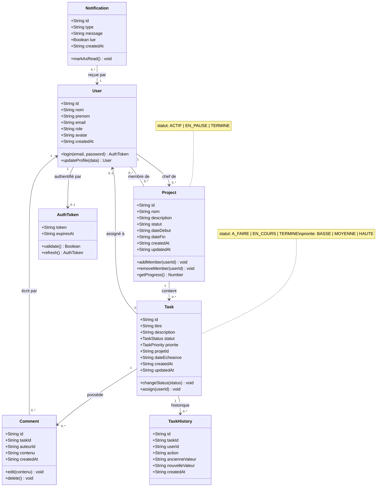
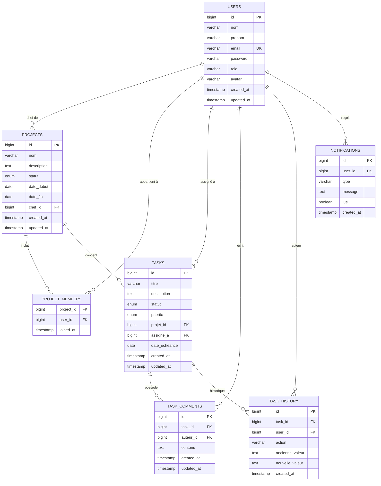
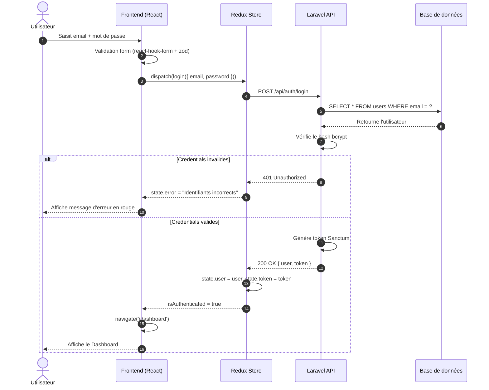
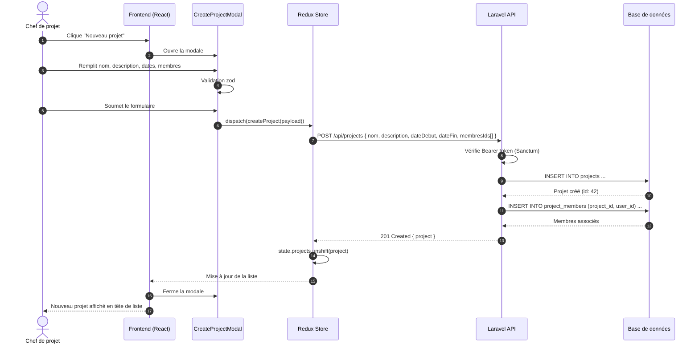
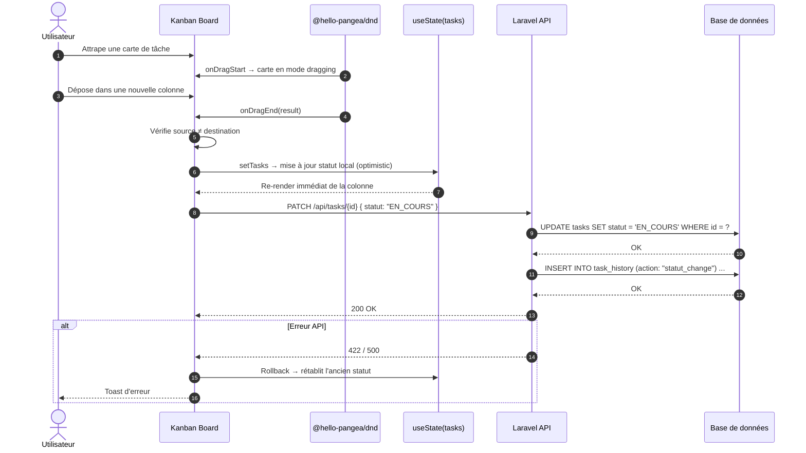
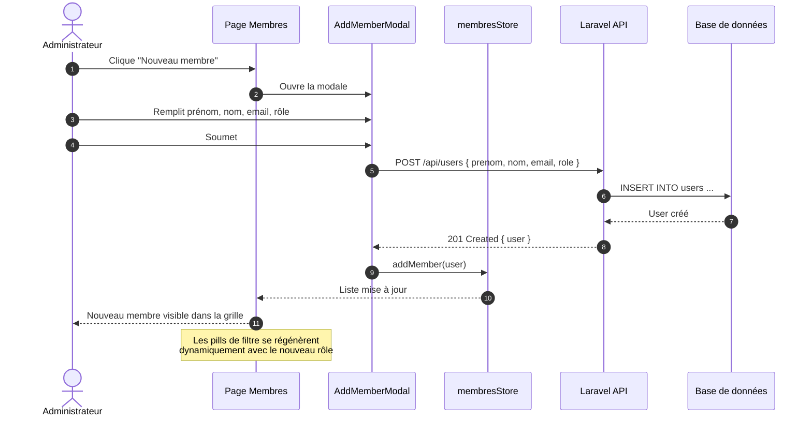
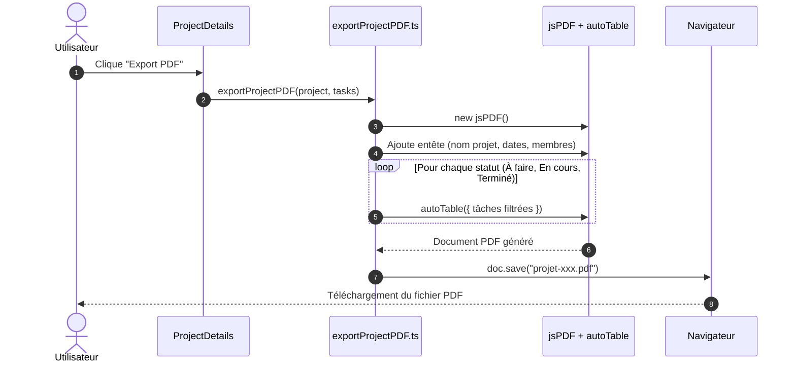
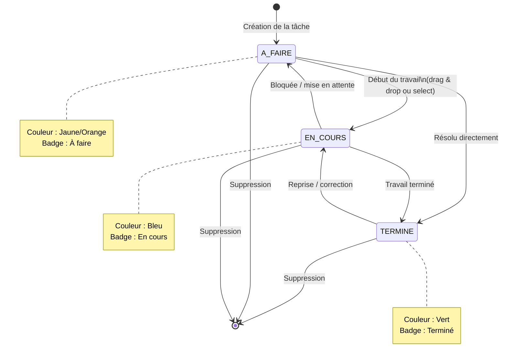

# Diagrammes UML — Digital Solutions · Gestion de Projets

> Tous les diagrammes sont écrits en syntaxe **Mermaid** et peuvent être rendus sur [mermaid.live](https://mermaid.live), dans VS Code (extension Mermaid), GitHub ou tout éditeur compatible.

---

## 1. Diagramme de Classes

---

## 2. Diagramme Entité-Relation (ER)

---

## 3. Diagramme de Cas d'Utilisation (Use Case)

```mermaid
flowchart TB
    subgraph Acteurs
        direction TB
        Admin["👤 Administrateur"]
        Chef["👤 Chef de projet"]
        Membre["👤 Membre"]
    end

    subgraph UC_Auth["🔐 Authentification"]
        UC1["Se connecter"]
        UC2["S'inscrire"]
        UC3["Se déconnecter"]
        UC4["Voir / Modifier son profil"]
    end

    subgraph UC_Proj["📁 Gestion des Projets"]
        UC5["Créer un projet"]
        UC6["Lister les projets"]
        UC7["Voir un projet"]
        UC8["Modifier un projet"]
        UC9["Supprimer un projet"]
        UC10["Ajouter un membre"]
        UC11["Exporter en PDF"]
    end

    subgraph UC_Task["✅ Gestion des Tâches"]
        UC12["Créer une tâche"]
        UC13["Voir les tâches (Kanban)"]
        UC14["Déplacer une tâche (drag & drop)"]
        UC15["Changer le statut"]
        UC16["Assigner une tâche"]
        UC17["Supprimer une tâche"]
        UC18["Voir le détail d'une tâche"]
        UC19["Commenter une tâche"]
    end

    subgraph UC_Members["👥 Gestion des Membres"]
        UC20["Lister les membres"]
        UC21["Ajouter un membre"]
        UC22["Modifier un membre"]
        UC23["Supprimer un membre"]
        UC24["Filtrer par rôle"]
    end

    subgraph UC_Stats["📊 Statistiques"]
        UC25["Voir le dashboard"]
        UC26["Voir le graphique projet"]
    end

    Admin --> UC1 & UC2 & UC3 & UC4
    Admin --> UC5 & UC6 & UC7 & UC8 & UC9 & UC10 & UC11
    Admin --> UC20 & UC21 & UC22 & UC23 & UC24
    Admin --> UC25 & UC26

    Chef --> UC1 & UC3 & UC4
    Chef --> UC5 & UC6 & UC7 & UC8 & UC10 & UC11
    Chef --> UC12 & UC13 & UC14 & UC15 & UC16 & UC17 & UC18 & UC19
    Chef --> UC25 & UC26

    Membre --> UC1 & UC3 & UC4
    Membre --> UC6 & UC7
    Membre --> UC13 & UC14 & UC15 & UC18 & UC19
    Membre --> UC24
```

---

## 4. Diagramme de Séquence — Authentification (Login)

---

## 5. Diagramme de Séquence — Création d'un Projet

---

## 6. Diagramme de Séquence — Déplacement d'une Tâche (Drag & Drop Kanban)

---

## 7. Diagramme de Séquence — Ajout d'un Membre à la Plateforme

---

## 8. Diagramme de Séquence — Export PDF d'un Projet

---

## 9. Diagramme d'Architecture Globale (Frontend ↔ Backend)

```mermaid
flowchart LR
    subgraph Client["🌐 Client (React + Vite)"]
        direction TB
        Pages["Pages\n(Dashboard, Projects,\nProjectDetails, Members, Profile)"]
        Components["Composants\n(AppLayout, TaskCard,\nProjectCard, Modals...)"]
        Hooks["Hooks\n(useProjects, useTasks,\nuseAuth, useAppStore)"]
        Redux["Redux Toolkit\n(authSlice, projectSlice,\ntaskSlice, uiSlice)"]
        Services["Services Axios\n(authService, projectService,\ntaskService)"]
    end

    subgraph Server["🖥️ Serveur (Laravel 11)"]
        direction TB
        Routes["routes/api.php"]
        Middleware["Middleware\n(auth:sanctum, cors)"]
        Controllers["Controllers\n(AuthController,\nProjectController,\nTaskController,\nUserController)"]
        Models["Eloquent Models\n(User, Project, Task,\nComment, Notification)"]
        DB[("MySQL\nPhpMyAdmin")]
    end

    Pages --> Components
    Components --> Hooks
    Hooks --> Redux
    Redux --> Services
    Services <-->|"HTTP REST API\nBearer Token"| Routes
    Routes --> Middleware --> Controllers
    Controllers --> Models --> DB
```

---

## 10. Diagramme d'État — Cycle de vie d'une Tâche

